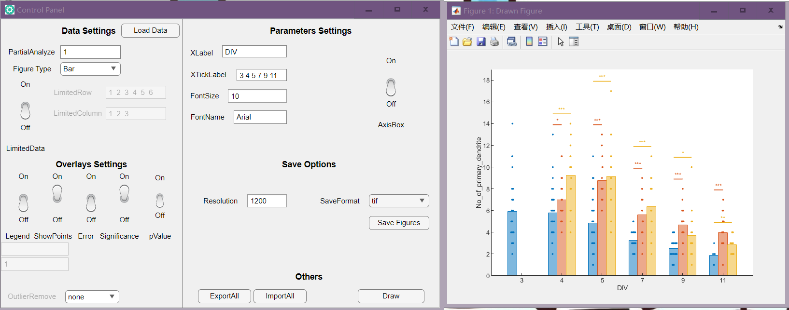
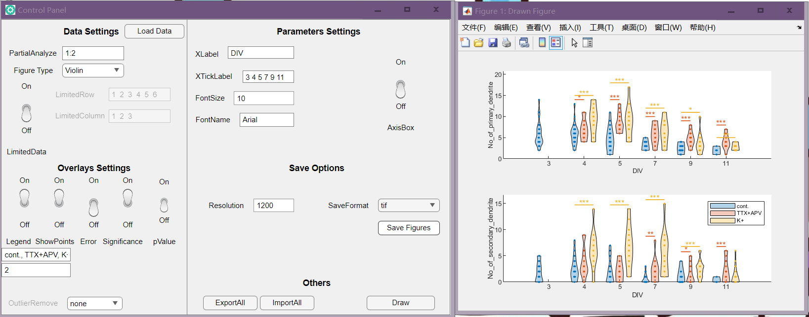
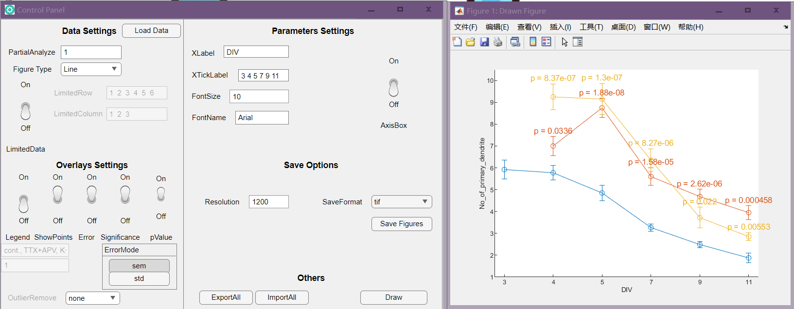
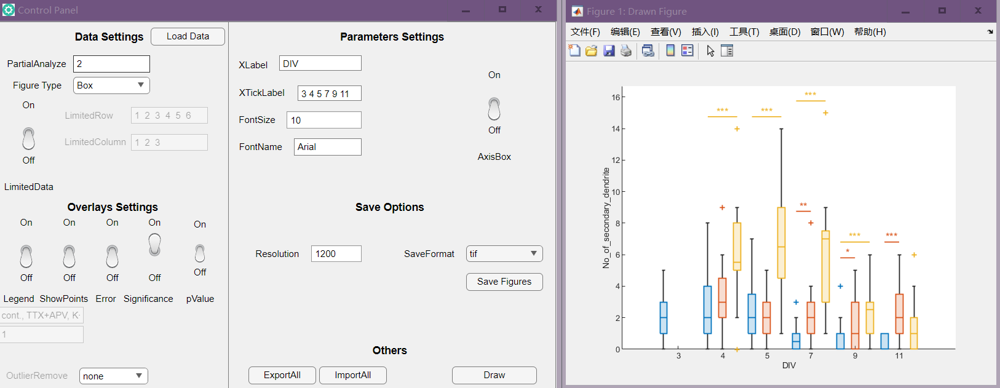

# DrawFigureApp
This Matlab App (a installer "DrawFigure.mlappinstall"included) is designated to draw scientific figures

## Figure type:
Support barplot, linechart, boxchart and violinplot

## Dataset:
You can use only a part of your raw dataset to draw the figures.
The related settings are PartialAnalyze, LimitedRow and LimitedColumn

## Overlays:
Support swarmchart to draw data points, errorbar, show siginificance (2 sample independent t-test only) and p-value (optional).

## Some example images:
Barplot with data points and significance

Violinplot with data points, significance and legend on designated panel 2

Linechart with errorbar and p-value

Boxchart with depicted outliers and significance

## How to use:
First use .\Functions\CreateData.m to create your own raw dataset, hints are provided in that file about how to create raw dataset.
Then open the app and load your dataset, do what you want.

The app opens the default raw dataset (.\Examples\RawDataset), you can use that one to explore the app first.

## Citation

[]https://zenodo.org/record/7880091#.ZE4w8P5BxPY
If you want to cite this repository, use 

> Lingjie, Tang, 2023. Bar plot, Line chart, Box chart and Violin plot for Matlab, Github Project  
>https://github.com/LingjieTang/MatlabCode_Lab/edit/main/Tang/General/DrawFigureApp, DOI: 10.5281/zenodo.7880091
